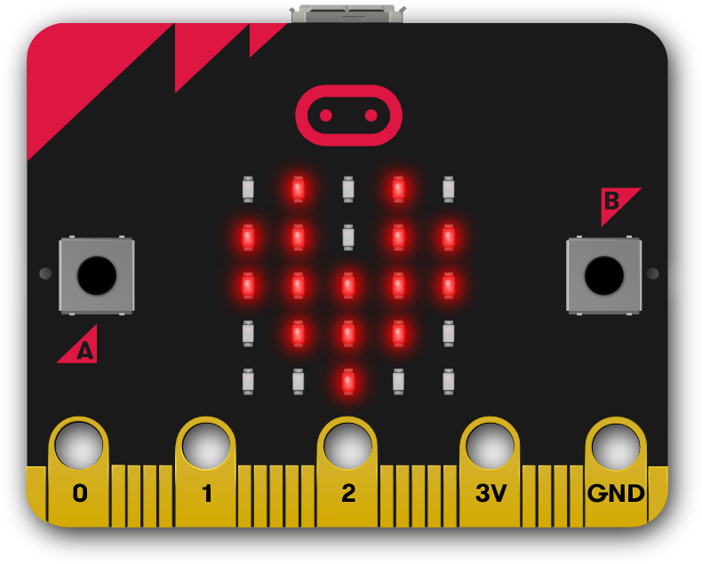
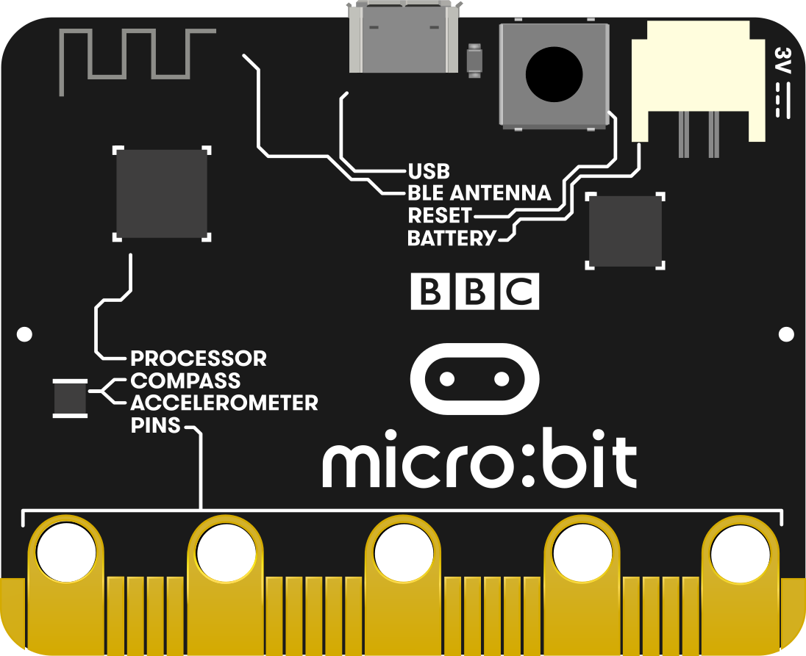

# What is a micro:bit?

### 

### What is a micro:bit?

The micro:bit is a small device that we can run code on to do cool stuff. 

A bit like a computer or a phone, it has buttons and sensors to input data and a built in screen to show us the output. 

It can also be connected to lots of other things so we can make sounds, send messages and control accessories.

#### Front 

* Two buttons labelled A and B
* A set of pins along the edge to connect it to other sensors and accessories
*   A screen to show messages. We can also use the screen to detect light levels.

#### Rear

* A Processor to run the code.
* Sensors that detect motion and temperature.
*  Power sockets; one for a micro USB cable \(like a phone charger cable\) and one for a battery connector.
* A radio transmitter to use the micro:bit wirelessly

There's lot's more information on the [features of the micro:bit on the microbit.org website](https://microbit.org/guide/features/), but for now  let's open the next project and have a go at Making a name badge.

