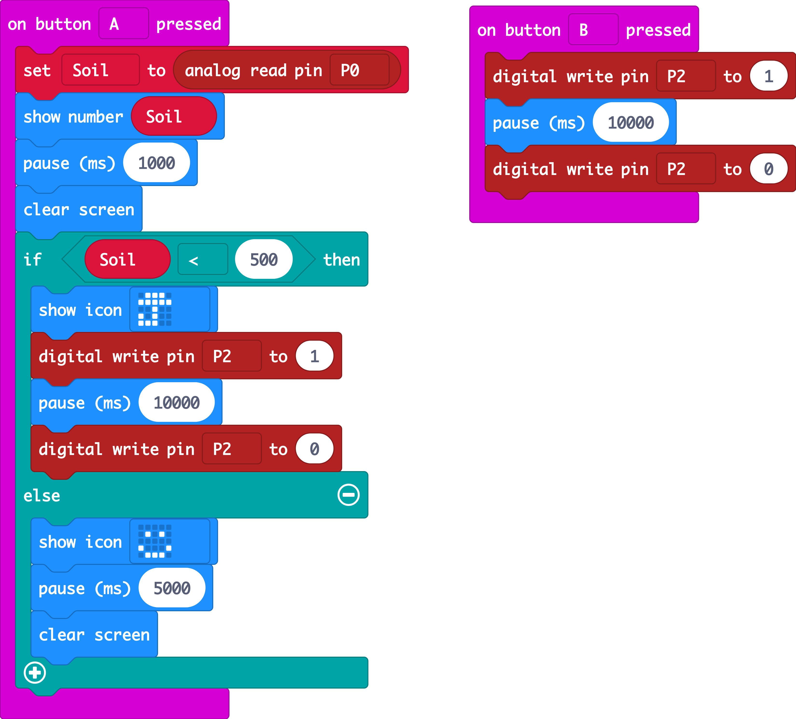

# Automatically water the plants

Fresh, clean water is a limited resource. While most of the planet is covered in water, it is salt water that can only be consumed by humans and other species after undergoing desalination, which is an expensive process. Occurrences such as droughts further limit access to clean and fresh water, meaning people need to take steps to reduce water use and save as much water as possible. In some areas of the world, access to water is limited due to contamination. People who have access to fresh water can take steps to limit their use of water to avoid waste. \(source: [The Water Page](http://www.thewaterpage.com/important-water.htm)\)

Using a house plant and a micro:bit we will find a way to detect how dry the soil is and if it's too dry, give our plant some water. We'll test our process, so that we only give the plant as much water as it needs when it's thirsty, just using the water that is necessary for our plant to thrive.

### Things you will need:

* micro:bit with AAA battery pack
* crocodile clip leads
* moisture sensor 
* water pump
* large battery pack
* a plant to water
* water \(in a tub or jar\)

### Part 1 - Detecting moisture

Connect the moisture sensor to the micro:bit with the crocodile clip leads:  
+ goes to 3v  
- goes to GND  
droplet symbol goes to pin0

Add some dry soil to a plant pot and a seedling.

### Code it

This code takes a reading from the pin and displays it on the LED screen of the micro:bit. Flash this code to your micro:bit.

\*\*\*\*[https://makecode.microbit.org/\_dfbAaR36o5Wo](https://makecode.microbit.org/_dfbAaR36o5Wo)

### Take some readings

Place the moisture sensor in the plant pot, it shouldn't register much. Try adding some water to see the change.

### Modify it

This code takes a constant reading and displays a graph, try to modify the code so that we display the current reading when we **press Button A.**

We should also try to conserve energy. Try **reducing the LED brightness** and **only taking a reading every 5 seconds.**

### Part 2 - Watering the plant when it's dry

Let's remove our moisture detector or now and work on the plant watering.

Using the crocodile clips, connect the pump trigger lead to **Pin 2** and ****the pump black lead to **GND** on the micro:bit. 

Now connect the **battery pack positive \(red\) lead** to the **pump red lead** and the **battery pack 0V \(black\) lead** also to the GND on the micro:bit. This way there is a common ground for all the circuitry. You might need to attach the crocodile clips to one another to achieve this.

### Code it

This code builds upon our last program by taking a reading when **Button A is pressed.** If the ****reading is below 500 \(about half way between 0 being the most dry and 1023 being the most wet\), we show a picture of an umbrella and we trigger the pump to operate. See if you can figure out what the rest of the program does and then flash the code to your micro:bit.

[https://makecode.microbit.org/\_AzF0JkKTAeP7](https://makecode.microbit.org/_AzF0JkKTAeP7)

### Watering our plant

Place the pump in a container of water and the open tube over our plant pot. Add the moisture sensor back to the plant pot and try pressing A to trigger it. Did the plant need some water?

### Modify it

We probably don't want to water our plants at night, so how about changing the code to detect the **light level** on the micro:bit. What about if it's too hot or cold? We don't want the water to just evaporate, so we could also check ,if the temperature is too high.

