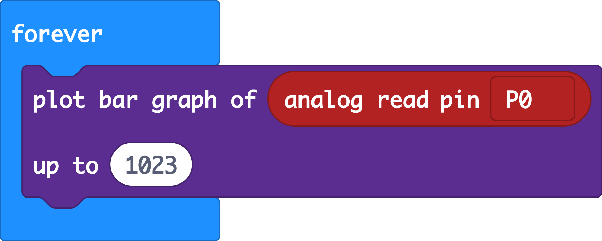

# Automatically water the plants

Fresh, clean water is a limited resource. While most of the planet is covered in water, it is salt water that can only be consumed by humans and other species after undergoing desalination, which is an expensive process. Occurrences such as droughts further limit access to clean and fresh water, meaning people need to take steps to reduce water use and save as much water as possible. In some areas of the world, access to water is limited due to contamination. People who have access to fresh water can take steps to limit their use of water to avoid waste. \(source: [The Water Page](http://www.thewaterpage.com/important-water.htm)\)

Using a house plant and a micro:bit we will find a way to detect how dry the soil is and if it's too dry, give our plant some water. We'll test our process, so that we only give the plant as much water as it needs when it's thirsty, just using the water that is necessary for our plant to thrive.

### Things you will need:

* micro:bit with battery pack
* crocodile clip leads
* moisture sensor 
* water pump
* a plant to water

### Part 1 - Detecting moisture

Connect the moisture sensor to the micro:bit with the crocodile clip leads:  
+ goes to 3v  
- goes to GND  
droplet symbol goes to pin0

Add some dry soil to a plant pot and a seedling.

### Code it

This code takes a reading from the pin and displays it on the LED screen of the micro:bit

\*\*\*\*[https://makecode.microbit.org/\_dfbAaR36o5Wo](https://makecode.microbit.org/_dfbAaR36o5Wo)

### Take some readings

Place the moisture sensor in the plant pot, it shouldn't register much. Try adding some water to see the change.

### Modify it

This code takes a constant reading and displays a graph, try to modify the code so that we display the current reading when we **press Button A.**

We should also try to conserve energy. Try **reducing the LED brightness** and **only taking a reading every 5 seconds**

### Part 2 - Watering the plant when it's dry

