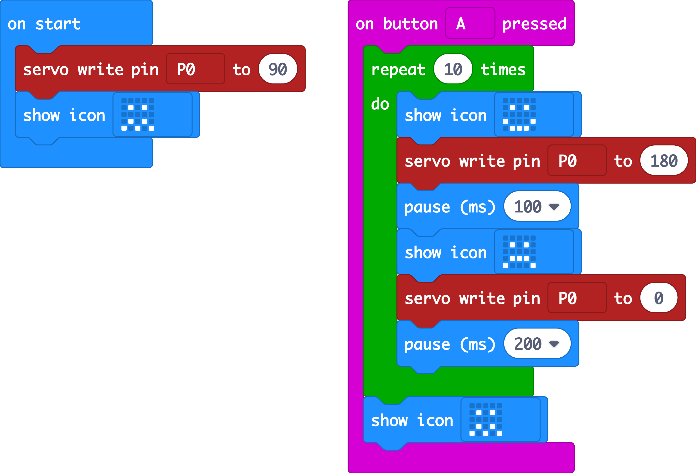

# Make a garbage monster

In  2016,  **320 million tons** of plastic were used across the world. Much of this was designed only to be used once and then discarded, such as plastic bottles. Plastic doesn't rot like paper or food , so these discarded items often find their way into our oceans and beaches and harm animals.

 Over **150 plastic bottles litter each mile of UK beaches** \(source: [surfers against sewage](https://www.sas.org.uk/our-work/plastic-pollution/plastic-pollution-facts-figures/)\).

We are going to turn some of this rubbish into a recyclable monster.

### Things you will need:

* micro:bit with battery pack
* servo
* crocodile clip leads
* string
* sellotape
* scissors
* garbage! - a drinks carton or plastic milk bottle, lollipop sticks or used straws.

### Let's get started

### Code it

[https://makecode.microbit.org/\_e8tHz42E5JJj](https://makecode.microbit.org/_e8tHz42E5JJj)

### Modify it

Could you change the image on the micro:bit display or how often and how much the arms move. How about recycling your monster and building another one with the same micro:bit and servo?

