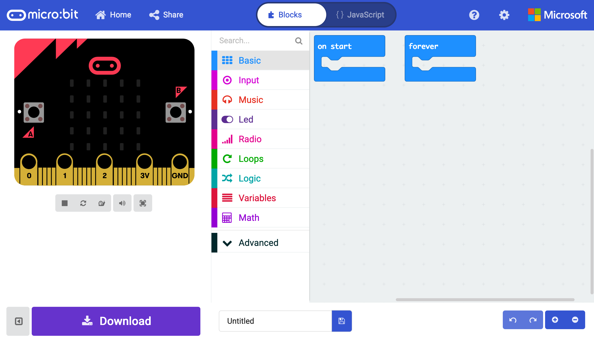
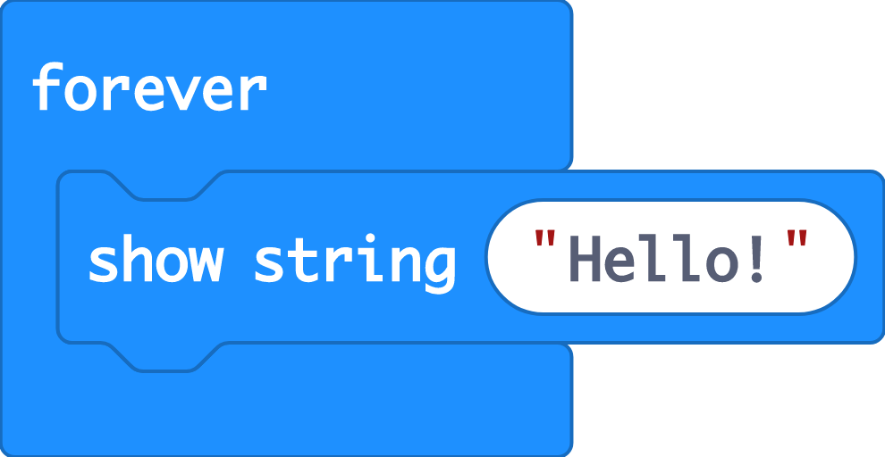
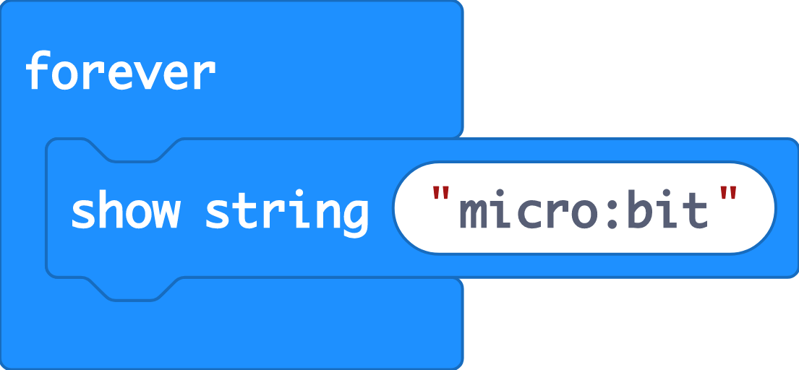
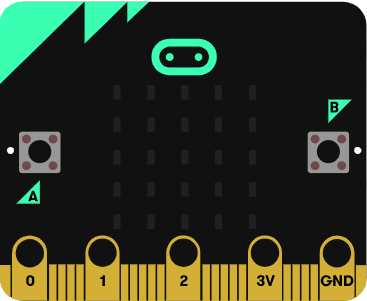
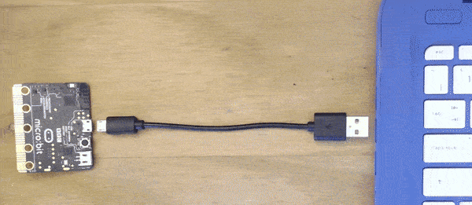
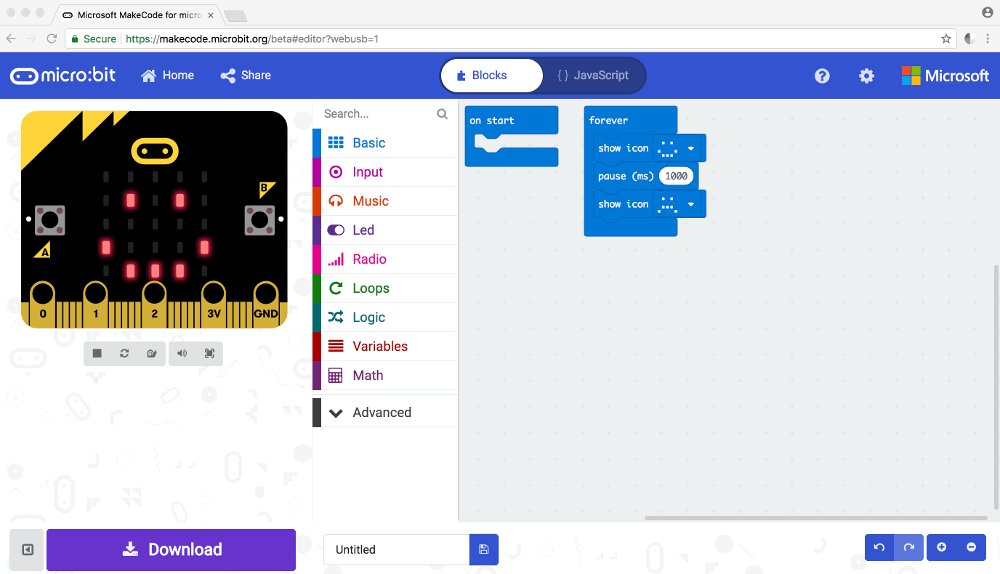

# Make a name badge

### Things you will need

* micro:bit with battery pack

### Code it

We'll be using the [MakeCode for micro:bit](https://makecode.microbit.org/) editor for this project and creating our program by joining up blocks of code.

In the **Google Chrome browser** Open a new project at [makecode.microbit.org](https://makecode.microbit.org/)

From the **Basic** blocks menu, drag out a **show string** block and place it within the **forever** loop.

Select the **Hello** text in the **show string** block and edit it so that it displays your name.

The simulator on the left of the screen will update to show your name scrolling across the micro:bit.

Drag  the unused **on start** block back into the menu it will be deleted as we're not going to need it in this program.

### Download the program


This step assumes you are using Google Chrome and have up to date [firmware](https://microbit.org/guide/firmware/) on the micro:bit


Connect your micro:bit to your computer via the micro USB cable.

Go to the **settings** menu in MakeCode, choose **Pair device \(**if you are asked, choose **Pair device** again**\)** and then Connect to the device listed as **BBC micro:bit CMSIS-DAP**

Choose **Download** to send the file to the micro:bit. The program should now be running on the micro:bit!

### Try it on battery

Disconnect the USB cable and connect up the battery pack

You can now walk around with your name badge! Can you find a way to attach it to your clothes?

### Modify it

Brilliant work. You've created a micro:bit name badge that you can wear in important meetings to introduce yourself. Now try modifying the code. How about using a block from the **Input** menu to display the name when you press a button or change the **show string** to show your favourite number.

