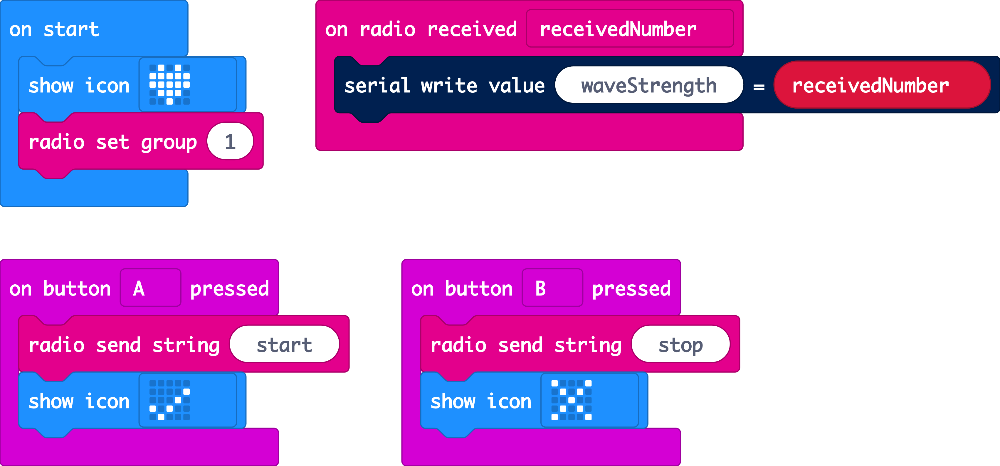

# Measure wave energy

 Ocean waves have a powerful influence on both marine life and the planet’s climate. The wind forms waves that travel easily across the surface of water, changing speed, frequency and depth depending on the wind force. This creates energy.

Hydroelectric power stations can harness wave energy and generate electricity from it, making  a more sustainable resource than traditional coal and oil power stations.\(Source, [Sciencing.com](https://sciencing.com/facts-7495930-do-measure-ocean-wave-energy.html)\).

The worldwide resource of coastal wave energy has been estimated to be greater than 2 TerraWatts; enough to power 70'000 homes per year \(Source, [Wikipedia](https://en.wikipedia.org/wiki/Wave_power)\).

However, the more powerful the wave the more harm it can do to the coastline. Passing boats for example can generate multiple waves in their wake and storms produce larger waves that can cause coastal erosion.

So how might we measure the potential power of the ocean and the effect on our coastline? By throwing a micro:bit in the sea... well in a watertight jar anyway.

### Things you will need

* jam jar
* micro:bit with battery pack
* second micro:bit to receive data
* string
* bubble wrap or suitable packing to protect the micro:bit in the jar
* strong tape to secure the jar and make it watertight

### Code it

For this project we are going to use two micro:bits. One will be our transmitter and will be contained in the jar, sending us the data from the accelerometer. The second will be our receiver and will allow us to view the wave data on our screens in real time!

### Transmitter

[https://makecode.microbit.org/\_5xghRpEU24fj](https://makecode.microbit.org/_5xghRpEU24fj)

### Receiver

[https://makecode.microbit.org/\_M9CeCTbTocP5](https://makecode.microbit.org/_M9CeCTbTocP5)

### Securing the jar

Make a loop around the jar with the string then tie a know \(description\). Once the micro:bit is safely inside we'll also secure the jar with tape to ensure the seal is air tight.

### Modify it

How might you modify the project to get better results? Could you change the jar, the code or the way you collect the data?

How about [uploading it to the cloud in real time](https://www.youtube.com/playlist?list=PLGYgoZPmYyek0eIEfVWyt3nK_J8iZ4OBP)?

